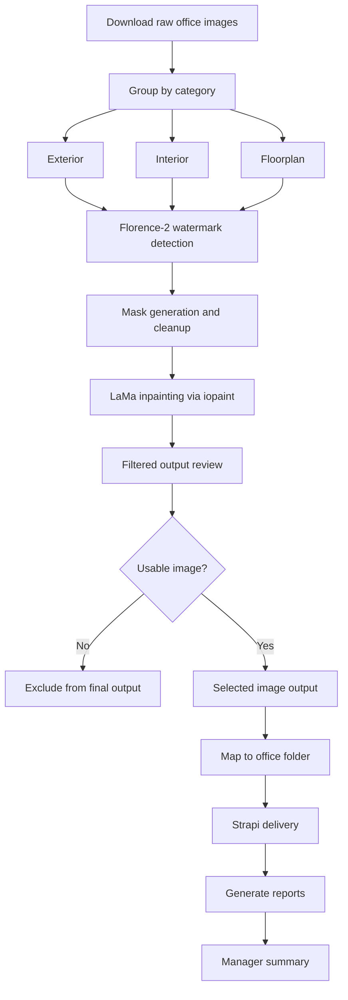

# Image Watermark Removal Report

Generated: 2026-06-17

## 1. What Happened

We processed office images through a watermark-removal and filtering workflow for three image types: exterior, interior, and floorplan.

From 9,770 raw images, 1,329 images were selected as usable output after watermark-removal processing and filtering. These selected images were then delivered to Strapi as the final publishing step.

| Result | Count |
| --- | ---: |
| Raw images reviewed | 9,770 |
| Images selected after filtering | 1,329 |
| Images excluded from final output | 8,441 |
| Images available after CMS delivery | 1,329 |
| Upload failures | 0 |

Key takeaway: the workflow produced 1,329 usable image candidates. CMS delivery completed successfully with no failed uploads.

Important limitation: the current approach relies on LaMa/inpainting-based removal, not a model trained specifically on our office image and watermark dataset. This is the main reason visual quality can vary.

## 2. What Result We Got

The goal was not to keep every raw image. The goal was to keep images that were relevant, cleaner, and suitable enough to become product image candidates.

| Category | Raw images | Selected output | Excluded | Selected rate |
| --- | ---: | ---: | ---: | ---: |
| Exterior | 2,342 | 357 | 1,985 | 15.24% |
| Interior | 6,556 | 846 | 5,710 | 12.90% |
| Floorplan | 872 | 126 | 746 | 14.45% |
| Total | 9,770 | 1,329 | 8,441 | 13.60% |

| Category | Final output notes |
| --- | --- |
| Exterior | 357 selected images from the prior verified processed batch. |
| Interior | 846 selected images, the largest output set. |
| Floorplan | 126 selected images. All selected floorplan images were delivered successfully. |

## 3. What The Risks And Limitations Are

The workflow improved image usability, but it does not guarantee every image is visually perfect. The main limitation is image restoration quality, not CMS delivery.

| Area | Constraint / issue | Why it matters |
| --- | --- | --- |
| LaMa inpainting limitation | LaMa is a general inpainting model. It predicts plausible pixels inside the removed watermark area, but it cannot recover the exact original image content. | This can create blur, texture mismatch, repeated patterns, or unnatural details. |
| No domain-specific model | We did not train or fine-tune a model specifically for these office images and watermark patterns. | The result depends on generic inpainting behavior, so quality is not always consistent. |
| Training data requirement | Better quality would require clean reference images, paired watermarked/clean examples, or a curated dataset for model training. | Without training data, quality improvement is limited and hard to scale reliably. |
| Team capability gap | We as the Consumer & Growth team do not currently have dedicated ML/CV capability to train and evaluate a production-grade restoration model. | A proper model-training path would need ML/computer-vision expertise, dataset preparation, evaluation metrics, and likely GPU training resources. |
| Floorplan complexity | Floorplan images can contain text, lines, and watermarked areas close together. | Inpainting can damage useful floorplan details if the mask overlaps important content. |
| QA effort | Automated filtering helps, but it cannot fully replace visual review. | Product-facing images should still be sampled for quality before broad usage. |
| Machine/runtime | Processing and delivery were handled from a local machine. | Larger future batches may need a more reliable batch environment. |

## 4. How We Did It

This is the full process from raw image collection to final CMS delivery.

| Phase | Process | Purpose |
| --- | --- | --- |
| Source | Download raw office images. | Prepare the source image set. |
| Categorize | Group images by category: exterior, interior, and floorplan. | Keep processing and reporting aligned with product image types. |
| Detect | Detect likely watermark areas with Florence-2. | Find the area that needs removal. |
| Mask | Generate and clean watermark masks. | Control which pixels are sent to inpainting. |
| Inpaint | Run LaMa inpainting through iopaint. | Fill the removed watermark area with predicted surrounding content. |
| Filter | Filter and review output images. | Keep usable images and exclude weak output. |
| Map | Map selected images to office folders. | Prepare final delivery to the correct CMS folders. |
| Deliver | Upload selected images to Strapi. | Make final images available for CMS/product usage. |
| Report | Generate CSV and Markdown reports. | Keep an audit trail for product, content, and engineering review. |

## 5. What Technology We Used

These are the main technologies used in the workflow and how they connect to each step above.

Repository: https://github.com/cendolicious/WatermarkRemover-AI

| Technology | Role in the workflow | Why we used it |
| --- | --- | --- |
| Python CLI workflow | Runs the local batch image processing. | Easier to process many files and folders repeatably. |
| Florence-2 | Detects likely watermark areas in each image. | Helps locate where removal should happen. |
| OpenCV mask processing | Cleans and adjusts detected mask areas. | Gives better control over the exact region sent to inpainting. |
| Pillow | Reads, writes, rotates, and converts image files. | Provides reliable image file handling. |
| NumPy | Handles image arrays and pixel-level operations. | Supports mask and image manipulation. |
| LaMa inpainting | Fills the masked watermark area with predicted image content. | This is the core watermark-removal step. |
| iopaint | Provides the LaMa model integration used by the script. | Avoids building the inpainting model runner from scratch. |
| PyTorch | Runs the AI models and tensor operations. | Required backend for Florence-2 and LaMa. |
| Hugging Face Transformers | Loads and runs Florence-2. | Standard library for using the Florence-2 model. |
| Node.js upload script | Delivers selected images to Strapi and writes upload reports. | Keeps CMS delivery automated and auditable. |
| Strapi Media Library API | Final destination for selected images. | Makes processed images available for CMS/product usage. |
| CSV and Markdown reports | Stores processing and delivery summaries. | Provides an audit trail for review. |

The most important quality-related technology is LaMa. It can produce visually plausible fills, but it does not know the original hidden pixels behind the watermark. To improve beyond this limitation, we would need a separate ML/CV effort with proper training data and model evaluation.

## 6. Why We Used Local Processing

We used local machine processing instead of an AI subscription tool or agentic AI workflow because this batch needed controlled, repeatable image processing at scale.

| Reason | Explanation |
| --- | --- |
| Batch size | The source set had 9,770 images. Processing that many images through a subscription AI tool would be slower, harder to monitor, and likely limited by quotas or rate limits. |
| Output control | Local processing gave us direct control over input folders, output folders, filtering, reports, and final delivery. |
| Reproducibility | The same local workflow can be rerun and audited from saved files and CSV reports. Subscription tools are usually harder to reproduce exactly. |
| Data handling | Local processing reduced the need to send a large image set to external AI services. |
| Legal and policy restrictions | Many AI subscription tools restrict or refuse watermark-removal requests because watermark removal can involve copyright, ownership, or misuse concerns. Local processing allowed us to run the workflow only on the approved image set under our internal responsibility and review process. |
| Agentic AI limitation | Agentic AI can help orchestrate tasks, but it does not solve the core image restoration problem by itself. The quality issue still depends on the inpainting model and training data. |
| Cost control | Local processing avoids per-image or subscription usage costs for large batch execution. |

This decision was practical, not a claim that local processing gives the best possible image quality. For higher quality watermark removal, the main improvement path is still a trained or fine-tuned image restoration model with proper training data.

## 7. What Was Delivered To CMS

Strapi upload was the final delivery step after watermark-removal processing and filtering.

| Category | Selected output | CMS delivery status | Failed |
| --- | ---: | --- | ---: |
| Exterior | 357 | Complete | 0 |
| Interior | 846 | Complete | 0 |
| Floorplan | 126 | Complete | 0 |
| Total | 1,329 | Complete | 0 |
